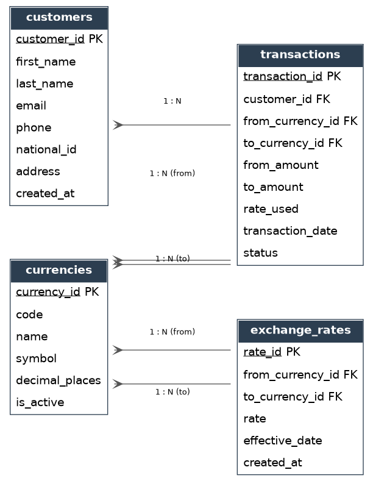
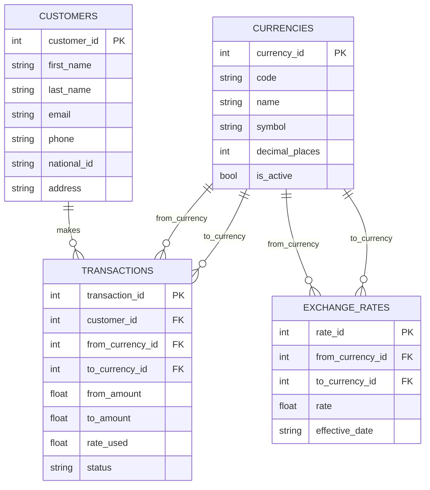

# Money Exchange System

A small database + OOP data layer for a currency exchange business to manage
**customers**, **currencies**, **exchange rates**, and **exchange transactions**.

Built with Python's standard library only (`sqlite3` + `dataclasses`) — no
external dependencies, runs anywhere with Python 3.8+.

---

## 1. How many tables, and why

The database has **4 tables**. Each one models a distinct real-world concept
that the business needs to track independently, and none of them can be
safely folded into another without losing data integrity or history.

### `customers`
Stores who the business is trading with: name, contact details, and a
`national_id` (required for KYC/AML — currency exchange businesses are
legally required to identify who they trade with). This has to be its own
table because a customer is a long-lived entity that is referenced by many
transactions over time — storing customer details on every transaction row
would duplicate data and make it impossible to update a customer's details
in one place.

### `currencies`
A reference/lookup table of every currency the business handles (code, name,
symbol, decimal precision, active flag). This is separated out so that
currency data is defined **once** and referenced by ID everywhere else,
rather than re-typing "US Dollar" / "$" / "USD" as free text in every rate
and transaction row (which would risk typos and inconsistent formatting).

### `exchange_rates`
Rates are a **relationship between two currencies** (e.g. USD → EUR) that
**changes over time**. This can't live inside `currencies` because a rate
needs two currency references, not one, and a business needs to keep a
history of past rates for auditing — not just overwrite the latest one.
Each row is one rate for one currency pair, effective at a point in time.

### `transactions`
The core business event: a customer converting an amount of one currency
into another. It records `rate_used` and both amounts **at the time of the
trade**, rather than recalculating from `exchange_rates` later — this is
essential because rates change, and a completed transaction must stay
accurate forever even after the rate table has moved on. This table is what
ties `customers` and `currencies` together and is the one an accountant or
auditor will query most often.

**Why not fewer tables?** Merging `exchange_rates` into `transactions` (or
`currencies`) would either lose rate history or make it impossible to look
up "what's today's rate" without scanning transactions. Merging `customers`
into `transactions` would duplicate personal data on every trade and make
GDPR-style "update/delete a customer's info" impossible to do consistently.

**Why not more tables?** A currency exchange system genuinely doesn't need
more than this for the stated scope (customers, currencies, rates,
transactions) — a 5th table (e.g. `staff`, `branches`, `audit_log`) would be
reasonable extensions but are out of scope for this exercise, listed under
[Future Improvements](#future-improvements).

---

## 2. Entity-Relationship Diagram



- One `customer` has many `transactions` (1:N)
- One `currency` can be the "from" or "to" side of many `exchange_rates`
  and many `transactions` (1:N, twice — once per role)

A Mermaid source (`diagrams/er_diagram.mmd`) is also included and renders
natively when viewed on GitHub:



---

## 3. Project structure

```
money-exchange-system/
├── README.md
├── requirements.txt
├── .gitignore
├── sql/
│   └── schema.sql            # raw DDL for all 4 tables
├── src/
│   ├── models.py              # OOP domain classes (Customer, Currency, ExchangeRate, Transaction)
│   ├── database.py            # Database + Repository classes (data access) + ExchangeService (business logic)
│   └── demo.py                 # seeds data and runs sample exchanges end-to-end
├── tests/
│   └── test_exchange.py       # unittest suite (stdlib only)
└── diagrams/
    ├── er_diagram.dot          # Graphviz source
    ├── er_diagram.png          # rendered diagram
    ├── er_diagram.svg
    └── er_diagram.mmd          # Mermaid source (renders on GitHub)
```

## 4. OOP design

- **`models.py`** — one `@dataclass` per table (`Customer`, `Currency`,
  `ExchangeRate`, `Transaction`), each responsible only for representing and
  validating its own data (e.g. `Transaction.__post_init__` rejects
  negative amounts; `ExchangeRate.convert()` does the currency math).
- **`database.py`**:
  - `Database` — owns the SQLite connection and schema setup.
  - `CustomerRepository`, `CurrencyRepository`, `ExchangeRateRepository`,
    `TransactionRepository` — one repository per table (Repository pattern),
    each exposing `create` / `get` / `list` methods so SQL is never
    scattered through business logic.
  - `ExchangeService` — a facade that composes the repositories to perform
    a full exchange (look up the latest rate, compute the converted amount,
    persist the transaction) as a single call: `service.exchange(...)`.

## 5. Getting started

```bash
git clone <this-repo-url>
cd money-exchange-system

# 1. Run the demo (creates exchange.db, seeds data, performs sample exchanges)
python3 src/demo.py

# 2. Run the tests
python3 -m unittest discover -s tests -v

# 3. (optional) Inspect the raw schema
sqlite3 exchange.db ".schema"
```

Requires Python 3.8+ only — no `pip install` needed.

## 6. Example usage

```python
from database import Database, ExchangeService
from models import Customer, Currency, ExchangeRate

with Database("exchange.db") as db:
    db.init_schema()
    service = ExchangeService(db)

    usd = service.currencies.create(Currency(code="USD", name="US Dollar", symbol="$"))
    eur = service.currencies.create(Currency(code="EUR", name="Euro", symbol="€"))
    service.rates.create(ExchangeRate(from_currency_id=usd.currency_id, to_currency_id=eur.currency_id, rate=0.92))

    alice = service.customers.create(Customer(first_name="Alice", last_name="Nguyen", national_id="P1234567"))

    tx = service.exchange(customer_id=alice.customer_id, from_code="USD", to_code="EUR", from_amount=500)
    print(tx)  # Transaction#1 customer=1 500 -> 460.0 @ 0.92 [COMPLETED]
```

## Future Improvements

- `staff` table to track which employee processed each transaction
- `branches` table for multi-location businesses
- Multi-currency wallet/balance tracking per customer
- REST API layer (FastAPI/Flask) on top of `ExchangeService`
- Swap SQLite for PostgreSQL for concurrent multi-user access
