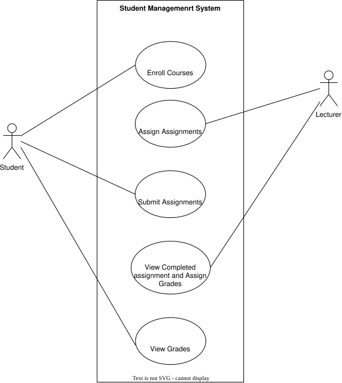
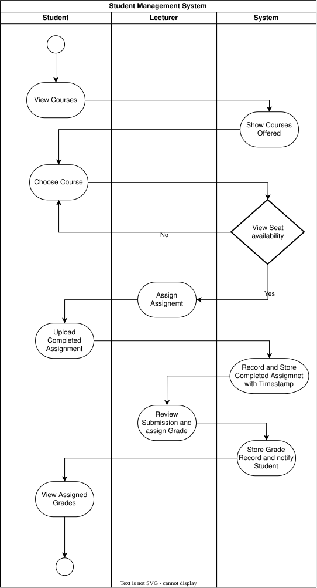
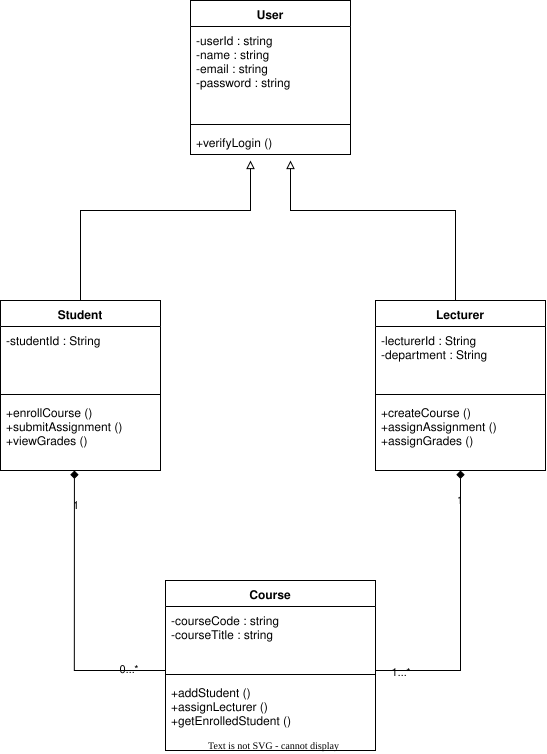

# Student Management System

## Use Case Diagram For Student Management System Week-5 Activity 1

**Use Case Description**

In this use case diagram there are two actors interacting with the system and the actors are Student and Lecturer. The two actors are interacting with the system.

Student(actor) interacts with the system to: 
-Enroll Courses 
-Submit Assignments 
-View Grades

Lecturer(actor) interacts with the system to: 
-Assign assignments 
-View Completed assignments and Assign grades

## Activity Diagram Student Management System Week-5 Activity 2

**Activity Diagram Description**

In the activity diagram the workflow goes like this:

1. Start
2. Student views available courses.
3. Student selects a course and submits an enrollment request.
4. System checks seat availability:
   If invalid/full: System displays error -> Return to selection.
   If valid: System confirms enrollment.
5. Lecturer posts an assignment for the course.
6. Student uploads the completed assignment file.
7. System records submission timestamp and stores the file.
8. Lecturer reviews submission and assigns a grade.
9. System updates grade record and notifies student.End

## Class Diagram For Student Management System Week-5 Activity 3

**Class Diagram Description**

In this class diagram there are 4 classes

_User class_: It is the parent class of student and lecturer class. User class holds the attributes, userId :string, name : string, email : String and password : string. This class also contains a method, verifyLogin().

_Student class_: It is the child class of the user class. It inherits the attributes of its parent class. It holds attributes like studentId : string. This class also contains methods such as enrollCourse (), submitAssignment (), viewGrades ().

_Lecturer class_: It is also the child class of the user class. It inherits the attributes of its parent class. It holds attributes like lecturerId : String, department : String . This class also contains methods such as createCourse (), assignAssignment (), assignGrades ().

_Course class_: It holds attributes like courseCode : string, courseTitle : string. This class also contains methods such as addStudent (), assignLecturer (), getEnrolledStudent ().

Relationships:
Student $\leftrightarrow$ Course: Many-to-Many ($* \dots *$) — A student enrolls in multiple courses; a course has multiple students.
Lecturer $\leftrightarrow$ Course: One-to-Many ($1 \dots *$) — A lecturer teaches one or more courses; each course is taught by a lecturer.
